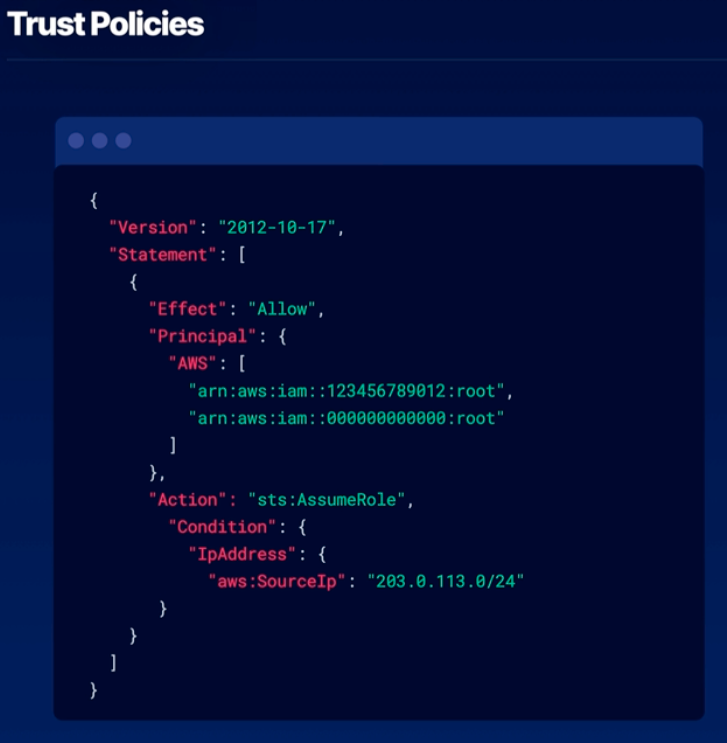

# Sharing Roles Across Accounts
In order to grant a principal access to a role in your account, you have to attach both a permissions set and a trust policy

## What can assume a role?
- IAM roles can be assumed directly by individual IAM users, AWS services, non-AWS workloads, and federated users, given the appropriate trust policies and permissions. Granting an IAM group permission to assume a role allows each IAM user within the group to indirectly assume the role independently.

## How to share roles across accounts
1. Define permissions
  - define the permissions that the cross-account entities will have when they assume the role you intend to share
2. Create trust policy
  - a trust policy defines the principals that can grant access to a given role. These can be accounts, resources, users, or groups
3. Allow access to role
  - the trusted account must grant AssumeRole permissions to the user, group, or service

## Trust policies

1. the principal determines which roles form outside accounts can assume your defined role
2. the action allows the AssumeRole action for listed principals
3. conditions can be added to limit the scope of the trust policy

## Common Use Cases
- External Users: allow external users limited access to your AWS account for auditing purposes
- Cross-Account Serverless: allow a Lambda function or other service to assume a role to trigger events in secondary account
- Application Permission: grant permissions to workloads running in AWS with IAM roles, or outside of AWS with IAM Roles Anywhere