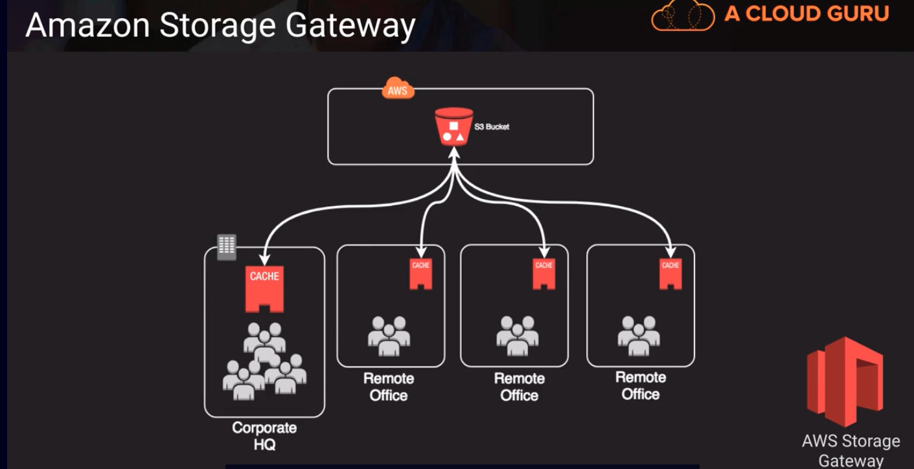

# Amazon Storage Gateway(FSx File Gateway)

- Virtual machine that you run on-premises with VMWare or HyperV OR via a specially configured Dell hardware appliance. Can also be run on EC2.
- Provides local storage resources backed by AWS S3 and Glacier -> you can spin up a storage gateway in your data center and then mount volumes locally. Storage gateway contains logic to synchronize that data back and forth to S3 or Glacier
- Used as a hot site (for disaster recovery preparedness to sync to AWS cloud)
- Useful in cloud migrations -> can act as a lazy way to slowly sync a bunch of data over time to AWS.

## Different Modes
| different modes | old name | new name | interface | function |
|:---------------:|:--------------------:|:------------------:|:------------:| :----------------------------------------------------------------:|
| 1               | n/a (not applicable)| File gateway | NFS, SMB | allow on-prem or EC2 instances to store objects in S3 via NFS or SMB mount point |
| 2               | gateway-stored volumes | volume gateway stored mode | iSCSI | async replication of on-prem data to S3 |
| 3               | gateway-cached volumes | volume gateway stored mode | iSCSI | async replication of on-prem data to S3 |
| 4               | gateway-virtual tape library | tape gateway | iSCSI | virtual media changer and tape library for use with existing backup software |

1. old name: n/a (not applicable)
   new name: File gateway
   interface: NFS, SMB
   function: allow on-prem or EC2 instances to store objects in S3 via NFS or SMB mount point
2. old name: gateway-stored volumes
   new name: volume gateway stored mode
   interface: iSCSI
   function: async replication of on-prem data to S3 (all your data is stored in your data center, but behind the scenes there's a job that's running and syncing that out to S3)
3. old name: gateway-cached volumes
   new name: volume gateway cached mode
   interface: iSCSI
   function: primary data stored in S3 with frequently access data cached locally on-prem (what lives on your local volume in your data center is only those files or those objects that have been recently accessed. So it serves as a source of cache for your data that's living on S3)
    - companies would use this to help them transition and migrate into the cloud. They'll set up a volume gateway stored mode first, and the over time, sync all their data out to S3. At some point in time, swithc over to a cached mode and then most of their data is stored out on S3 and a small percentage is onsite. They can reduce or get rid of any requirement for on-premise storage using this method.
4. old name: gateway-virtual tape library
   new name: tape gateway
   interface: iSCSI
   function: virtual media changer and tape library for use with existing backup software

   
   - Since the storage gateway has a feature called bandwidth throttling. We can provide a synchronized file experience for the remote offices in the diagram. The remote offices might have a limited bandwidth, with gateway cached volume we are providing access and just the data that those remote offices need and its cached there locally for them.

   