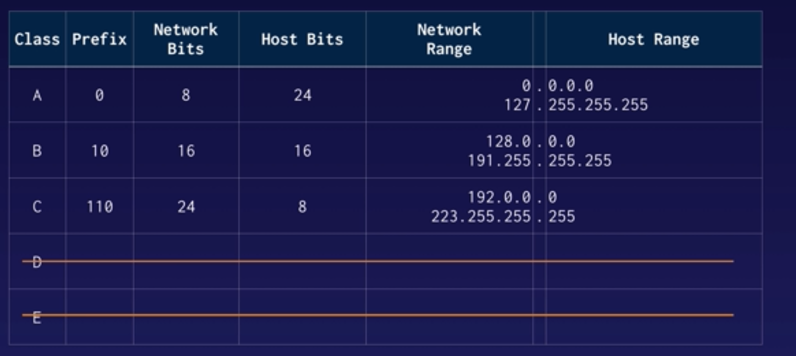

# Subnets & CIDR (classless inter-domain routing)

Each class of IP addresses has a private subnet range
Class A -> 10.0.0.0 with a subnet mask of 255.0.0.0
Class B -> 172.16.0.0 with a subnet mask of 255.255.0.0
Class C -> 192.168.0.0 with a subnet mask of 255.255.255.0

## CIDR -> a replacement for the old class based subnetting system
- used to give enough flexibility for running out of IPv4 addresses on the public internet
- much simpler than the old way with classes and subnet masks
CIDR block ex. 10.0.1.0/24
CIDR masks do not have to be divisible by 8 as opposed to classes.
- if we have a CIDR block of 10.0.1.0/25 it has a subnet mask of 255.255.255.128 means in that last octet is has 7 bits instead of 8 bits. This leaves 128 host addresses - 1 for Network and 1 for broadcast = 126 addresses

IPv4 uses 32 bits while IPv6 uses 128 bits